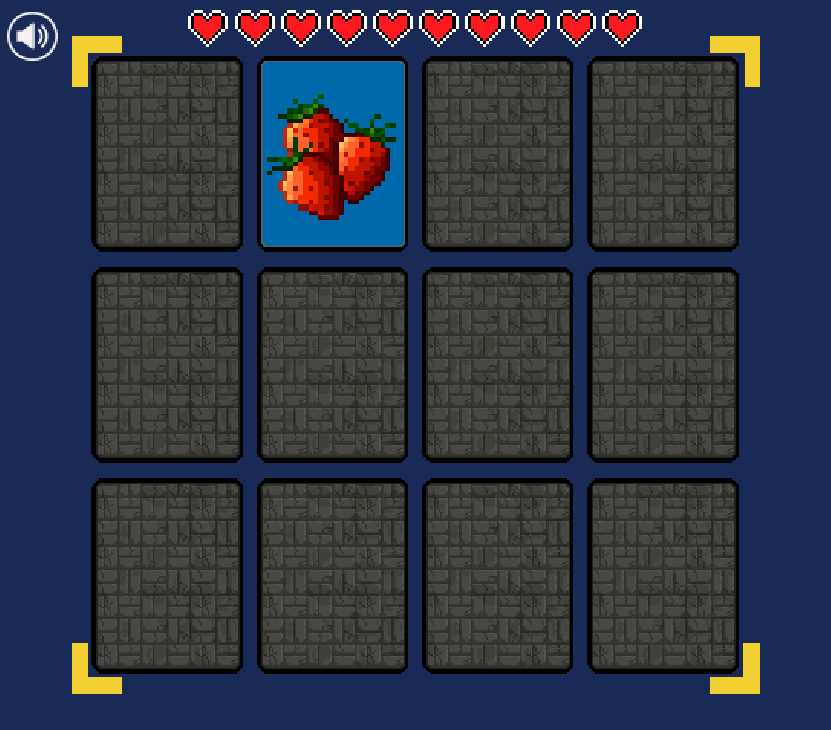

# Memory Card Game

This is a simple memory card game. The goal is to match all the cards in the fewest number of moves.

Click on a card to reveal its symbol. Click on a second card to reveal its symbol. If the symbols match, the cards will remain face up. If the symbols do not match, the cards will be hidden again. Continue until all cards are matched.

## Instructions

1. Clone the repository.
2. Install dependencies with `npm install`.
3. Start the development server with `npm run dev`.
4. If you want to build the project, run `npm run build`.

